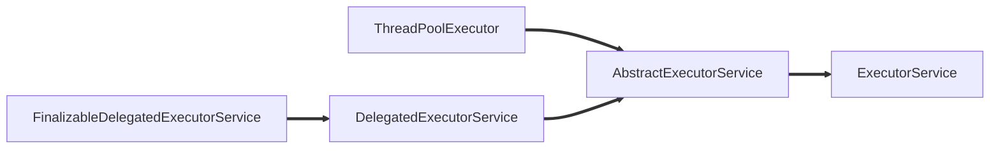

# ThreadPoolExecutor 使用

## 1. 构造

&emsp;ThreadPoolExecutor提供了四个构造方法：


&emsp;我们以最后一个构造方法（参数最多的那个），对其参数进行解释：
```java
public ThreadPoolExecutor(int corePoolSize,
                              int maximumPoolSize,
                              long keepAliveTime,
                              TimeUnit unit,
                              BlockingQueue<Runnable> workQueue,
                              ThreadFactory threadFactory,
                              RejectedExecutionHandler handler) {
        if (corePoolSize < 0 ||
            maximumPoolSize <= 0 ||
            maximumPoolSize < corePoolSize ||
            keepAliveTime < 0)
            throw new IllegalArgumentException();
        if (workQueue == null || threadFactory == null || handler == null)
            throw new NullPointerException();
        this.acc = System.getSecurityManager() == null ?
                null :
                AccessController.getContext();
        this.corePoolSize = corePoolSize;
        this.maximumPoolSize = maximumPoolSize;
        this.workQueue = workQueue;
        this.keepAliveTime = unit.toNanos(keepAliveTime);
        this.threadFactory = threadFactory;
        this.handler = handler;
    }
```
|  序号   | 名称  |  	类型   | 含义  |
|  ----  | ----  |----  |----  |
| 1 | corePoolSize | int                    | 核心线程数量  |
| 2 | maximumPoolSize | int                    | 最大线程池大小  |
| 3 | keepAliveTime   | long                   | 线程最大空闲时间|
| 4 | unit            | TimeUnit               | 时间单位       |
| 5 | workQueue       | BlockingQueue<Runnable>| 线程等待队列    |
| 6 | threadFactory   | ThreadFactory          |线程创建工厂     |

&emsp;如果对这些参数作用有疑惑的请看 [ThreadPoolExecutor](http://zhoujiapeng.top/java/java-threadPoolExecutor-overview/) 概述。知道了各个参数的作用后，我们开始构造符合我们期待的线程池。接下来我们看一下JDK预定义的几种线程池。

## 2. 预定义线程池

### 2.1 FixedThreadPool
```java
public static ExecutorService newFixedThreadPool(int nThreads) {
        return new ThreadPoolExecutor(nThreads, nThreads,
                                      0L, TimeUnit.MILLISECONDS,
                                      new LinkedBlockingQueue<Runnable>());
    }
```
- corePoolSize与maximumPoolSize相等，即其线程全为核心线程，是一个**固定大小**的线程池，是其优势；
- keepAliveTime = 0 该参数默认对核心线程无效，而FixedThreadPool**全部为核心线程**；
- workQueue 为LinkedBlockingQueue（**无界**阻塞队列），队列最大值为Integer.MAX_VALUE。如果任务提交速度持续大余任务处理速度，会造成队列大量阻塞。因为队列很大，很有可能在拒绝策略前，内存溢出。是其劣势；
- FixedThreadPool的任务执行是**无序**的；

> 适用场景：可用于Web服务瞬时削峰，但需注意长时间持续高峰情况造成的队列阻塞。

&emsp;下面是一个简单的例子。创建一个可重用固定线程数的线程池，以共享的无界队列方式来运行这些线程。在任意点，在大多数 nThreads 线程会处于处理任务的活动状态。如果在所有线程处于活动状态时提交附加任务，则在有可用线程之前，附加任务将在队列中等待。
```java
**
     * 创建固定大小的线程池
     */
    public static void createFixedThreadPool() {
        ExecutorService fixedThreadPool = Executors.newFixedThreadPool(5);
        final CountDownLatch countDownLatch = new CountDownLatch(5);
        for (int i = 0; i < 5; i++) {
            final int currentIndex = i;
            fixedThreadPool.execute(() -> {
                System.out.println(Thread.currentThread().getName() + ", currentIndex is : " + currentIndex);
                countDownLatch.countDown();
            });
        }
        try {
            countDownLatch.await();
        } catch (InterruptedException e) {
            e.printStackTrace();
        }
        System.out.println("全部线程执行完毕");
    }
```

### 2.2 CachedThreadPool
```java
public static ExecutorService newCachedThreadPool() {
        return new ThreadPoolExecutor(0, Integer.MAX_VALUE,
                                      60L, TimeUnit.SECONDS,
                                      new SynchronousQueue<Runnable>());
    }
```
- corePoolSize = 0，maximumPoolSize = Integer.MAX_VALUE，即**线程数量几乎无限制**；
- keepAliveTime = 60s，线程空闲60s后自动结束。
- workQueue 为 SynchronousQueue 同步队列，这个队列类似于一个接力棒，入队出队必须**同时传递**，因为CachedThreadPool线程创建无限制，不会有队列等待，所以使用SynchronousQueue；

> 适用场景：快速处理大量耗时较短的任务，如Netty的NIO接受请求时，可使用CachedThreadPool。

&emsp;下面是一个简单的例子。创建一个可缓存的无界线程池，该方法无参数。当线程池中的线程空闲时间超过60s则会自动回收该线程，当任务超过线程池的线程数则创建新线程。线程池的大小上限为Integer.MAX_VALUE，可看做是无限大。
```java
/**
     * 创建无边界大小的线程池
     */
    public static void createCachedThreadPool() {
        ExecutorService cachedThreadPool = Executors.newCachedThreadPool();
        final CountDownLatch countDownLatch = new CountDownLatch(10);
        for (int i = 0; i < 10; i++) {
            final int currentIndex = i;
            cachedThreadPool.execute(() -> {
                System.out.println(Thread.currentThread().getName() + ", currentIndex is : " + currentIndex);
                countDownLatch.countDown();
            });
        }
        try {
            countDownLatch.await();
        } catch (InterruptedException e) {
            e.printStackTrace();
        }
        System.out.println("全部线程执行完毕");
    }
```

### 2.3 SingleThreadExecutor
```java
public static ExecutorService newSingleThreadExecutor() {
        return new FinalizableDelegatedExecutorService
            (new ThreadPoolExecutor(1, 1,
                                    0L, TimeUnit.MILLISECONDS,
                                    new LinkedBlockingQueue<Runnable>()));
    }
```
- 单线程 (corePoolSize\==maximumPoolSize==1)
- 无界队列 (LinkedBlockingQueue)

&emsp;这里使用了newFixedThreadPool(1)，但是多了一层 FinalizableDelegatedExecutorService 包装，这一层有什么用呢，写个dome来解释一下：
```java
public static void main(String[] args) {
        ExecutorService fixedExecutorService = Executors.newFixedThreadPool(1);
        ThreadPoolExecutor threadPoolExecutor = (ThreadPoolExecutor) fixedExecutorService;
        System.out.println(threadPoolExecutor.getMaximumPoolSize());
        threadPoolExecutor.setCorePoolSize(8);
        
        ExecutorService singleExecutorService = Executors.newSingleThreadExecutor();
//      运行时异常 java.lang.ClassCastException
//      ThreadPoolExecutor threadPoolExecutor2 = (ThreadPoolExecutor) singleExecutorService;
    }
```
&emsp;对比可以看出，FixedThreadPool可以向下转型为ThreadPoolExecutor，并对其线程池进行配置，而SingleThreadExecutor被包装后，无法成功向下转型。因此，SingleThreadExecutor被确定以后，无法修改，做到了真正的Single。看一下它们的继承关系可能会更加清晰：


&emsp;可以看到 ThreadPoolExecutor 和 FinalizableDelegatedExecutorService 之间并没有继承关系，因此无法直接相互转换。

&emsp;下面是一个简单的例子。创建一个单线程的线程池，以无界队列方式来运行该线程。当多个任务提交到单线程线程池中，线程池将逐个去进行执行，未执行的任务将放入无界队列进行等待。
```java
/**
     * 创建单线程的线程池
     */
    public static void createSingleThreadPool() {
        ExecutorService singleThreadPool = Executors.newSingleThreadExecutor();
        singleThreadPool.execute(()-> System.out.println(Thread.currentThread().getName()));
    }
```

### 2.4 ScheduledThreadPool
```java
public static ScheduledExecutorService newScheduledThreadPool(int corePoolSize) {
        return new ScheduledThreadPoolExecutor(corePoolSize);
    }
```
&emsp;newScheduledThreadPool调用的是ScheduledThreadPoolExecutor的构造方法，而ScheduledThreadPoolExecutor继承了ThreadPoolExecutor，构造是还是调用了其父类的构造方法。
&emsp;更多关于 ScheduledThreadPoolExecutor 的介绍可以参考文章[《线程池 之 ScheduledThreadPoolExecutor概述》](http://zhoujiapeng.top/java/java-scheduledthreadPoolExecutor/)。

&emsp;下面是一个简单的例子。创建一个线程池，它可安排在给定延迟后运行命令或者定期地执行。
```java
 /**
     * 创建给定延迟后运行命令或者定期地执行的线程池
     */
    public static void createScheduledThreadPool() {
        ScheduledExecutorService scheduledThreadPool = Executors.newScheduledThreadPool(5);
        final CountDownLatch countDownLatch = new CountDownLatch(5);
        for (int i = 0; i < 5; i++) {
            final int currentIndex = i;
            //定时执行一次的任务，延迟1s后执行
            scheduledThreadPool.schedule(() -> {
                System.out.println(Thread.currentThread().getName() + ", currentIndex is : " + currentIndex);
                countDownLatch.countDown();
            }, 1, TimeUnit.SECONDS);
            //周期性地执行任务，延迟2s后，每3s一次地周期性执行任务
            scheduledThreadPool.scheduleAtFixedRate(() -> System.out.println(Thread.currentThread().getName() + "every 3s"), 2, 3, TimeUnit.SECONDS);
        }
    }
```

### 2.5 四种线程池对比
|线程池方法	| 初始化线程池数 | 最大线程池数|	线程池中线程存活时间| 时间单位 |工作队列 |
| -- | --- | -- | -- | -- | --| 
|newCachedThreadPool |0 |Integer.MAX_VALUE |60 |秒 |SynchronousQueue |
|newFixedThreadPool | 入参指定大小 | 入参指定大小 |0 |毫秒 |LinkedBlockingQueue |
|newScheduledThreadPool |入参指定大小 | Integer.MAX_VALUE |0 |微秒 |DelayedWorkQueue |
|newSingleThreadExecutor |1 |1 |0 | 毫秒 |LinkedBlockingQueue |

## 3. 自定义线程池
&emsp;ThreadPoolExecutor的构造方法：
```java
public ThreadPoolExecutor(int corePoolSize,
                              int maximumPoolSize,
                              long keepAliveTime,
                              TimeUnit unit,
                              BlockingQueue<Runnable> workQueue,
                              ThreadFactory threadFactory,
                              RejectedExecutionHandler handler)
```
&emsp;各个参数的含义为：
- corePoolSize - 池中所保存的线程数，包括空闲线程，必须大于或等于0。
- maximumPoolSize - 池中允许的最大线程数，必须大于或等于corePoolSize。
- keepAliveTime - 线程存活时间，当线程数大于核心时，此为终止前多余的空闲线程等待新任务的最长时间。
- unit - keepAliveTime 参数的时间单位，必须大于或等于0。
- workQueue - 工作队列，执行前用于保持任务的队列。此队列仅保持由 execute 方法提交的 Runnable 任务。
- threadFactory - 执行程序创建新线程时使用的工厂，默认为DefaultThreadFactory类。
- handler - 拒绝策略，由于超出线程范围和队列容量而使执行被阻塞时所使用的处理程序，默认策略为ThreadPoolExecutor.AbortPolicy。

&emsp;下面是自定义的线程池，使用了有界队列，自定义ThreadFactory和拒绝策略：
```java
public class CustomizeThreadPool {
    //自定义ThreadFactory
    static class MyThreadFactory implements ThreadFactory{

        private final AtomicInteger mThreadNum = new AtomicInteger(1);

        @Override
        public Thread newThread(Runnable r) {
            Thread t = new Thread(r,"my-thread-" + mThreadNum.getAndIncrement());
            System.out.println(t.getName() + " has been created!");
            return t;
        }
    }

    //自定义拒绝策略
    static class MyIgnorePolicy implements RejectedExecutionHandler{

        @Override
        public void rejectedExecution(Runnable r, ThreadPoolExecutor executor) {
            doLog(r,executor);
        }

        private void doLog(Runnable r,ThreadPoolExecutor e){
            System.out.println(r.toString() + " rejected!");
        }
    }

    static class MyTask implements Runnable {
        private String name;

        public MyTask(String name){
            this.name = name;
        }
        @Override
        public void run() {
            try {
                System.out.println(this.toString() + " is running on " + Thread.currentThread().getName());
                Thread.sleep(3000);
            }catch (InterruptedException e){
                e.printStackTrace();
            }
        }
        public String getName(){
            return name;
        }
        @Override
        public String toString() {
            return "MyTask [name = " + name + " ]";
        }
    }

    public static void main(String[] args) throws IOException {
        int corePoolSize = 2;
        int maximumPoolSize = 4;
        long keepAliveTime = 10;
        TimeUnit unit = TimeUnit.SECONDS;
        BlockingQueue<Runnable> workQueue = new ArrayBlockingQueue<>(2);
        ThreadFactory threadFactory = new MyThreadFactory();
        RejectedExecutionHandler handler = new MyIgnorePolicy();
        ThreadPoolExecutor executor = new ThreadPoolExecutor(corePoolSize,maximumPoolSize,keepAliveTime,
                unit,workQueue,threadFactory,handler){
            @Override
            protected void beforeExecute(Thread t, Runnable r) {
                super.beforeExecute(t, r);
            }
            @Override
            protected void afterExecute(Runnable r, Throwable t) {
                super.afterExecute(r, t);
            }
            @Override
            protected void terminated() {
                super.terminated();
            }
        };
        //预启动所有核心线程
        executor.prestartAllCoreThreads();

        for(int i=1;i<10;i++){
            MyTask task = new MyTask(String.valueOf(i));
            executor.execute(task);
        }
        System.in.read(); //阻塞主线程
    }
}
```
&emsp;执行结果为：
```
my-thread-1 has been created!
my-thread-2 has been created!
my-thread-3 has been created!
MyTask [name = 1 ] is running on my-thread-1
MyTask [name = 2 ] is running on my-thread-2
my-thread-4 has been created!
MyTask [name = 3 ] is running on my-thread-3
MyTask [name = 7 ] rejected!
MyTask [name = 6 ] is running on my-thread-4
MyTask [name = 8 ] rejected!
MyTask [name = 9 ] rejected!
MyTask [name = 4 ] is running on my-thread-2
MyTask [name = 5 ] is running on my-thread-1
```
&emsp;corePoolSize为2，一开始会依次创建两个线程执行task1和task2，接下来task3和task4会进入队列，task5和task6进来之后，由于maximumPoolSize为4，因此继续会创建两个线程，之后线程数量达到了maximumPoolSize，并且任务队列也满了，因此task7、8、9会被拒绝。
&emsp;通过自定义线程池，我们可以更好的让线程池为我们所用，更加适应我的实际场景。


&nbsp;
&nbsp;
> 参考：
https://www.jianshu.com/p/f030aa5d7a28
https://blog.csdn.net/wtopps/article/details/80682267

